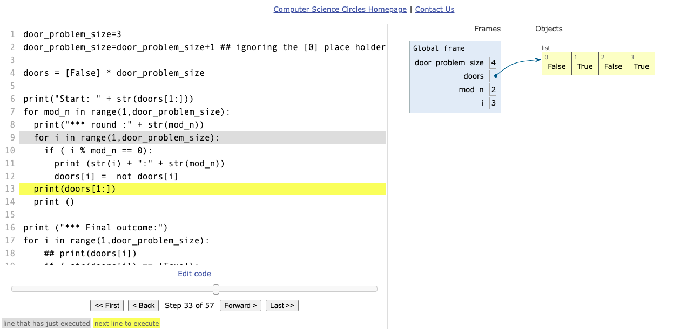

## Tracing algorithms using an online visualization tool

As per the course
> One particularly useful tool to help with understanding algorithms is a visualization which shows you clearly the values of the variables and the relationships between them as you step through a program. Now, there's a great example of this kind of tool online at the URL ...


and I'm really impressed with this [cscircles uwaterloo.ca online visualizer] https://cscircles.cemc.uwaterloo.ca/visualize#mode=display
* I was stepping through my tracing-3-door-problem-interim-solution ()
```
~/projects/algorithmic-thinking-with-python $ cat docs/100-door-problem-test-01.py 
door_problem_size=3
door_problem_size=door_problem_size+1 ## ignoring the [0] place holder

doors = [False] * door_problem_size

print("Start: " + str(doors[1:]))
for mod_n in range(1,door_problem_size):
  print("*** round :" + str(mod_n)) 
  for i in range(1,door_problem_size): 
    if ( i % mod_n == 0):
      print (str(i) + ":" + str(mod_n))
      doors[i] =  not doors[i]
  print(doors[1:])
  print ()
    
print ("*** Final outcome:")
for i in range(1,door_problem_size):
    ## print(doors[i])
    if ( str(doors[i]) == 'True'):
      print (str(i)) 
```
* being able to visualise the problem with real-time step-forward / step-backwards options is really nice
* I also really like the step count
* I also imagine this helps good modular design - very large and complex functions will be hard to visualise?


